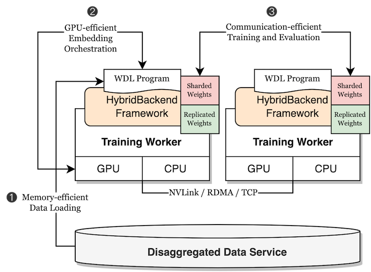

# Architecture

HybridBackend follows a shares-nothing architecture: A HybridBackend job
consists of single-GPU workers. Workers shares nothing and coordinates by
collective communication. Each worker reads environment variable `TF_CONFIG`
for cluster information.

