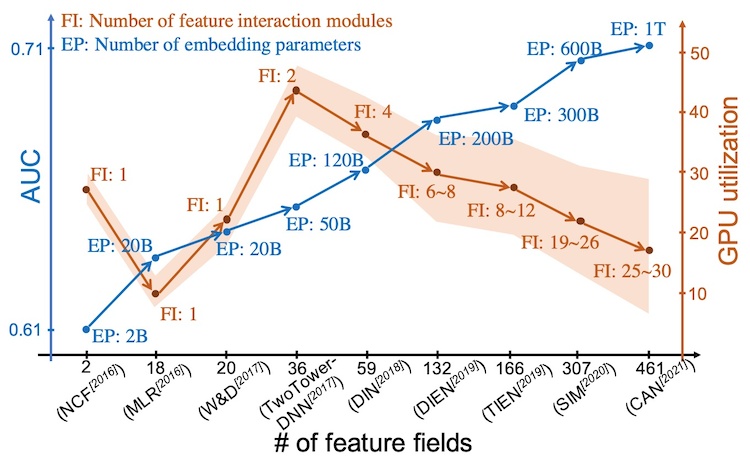
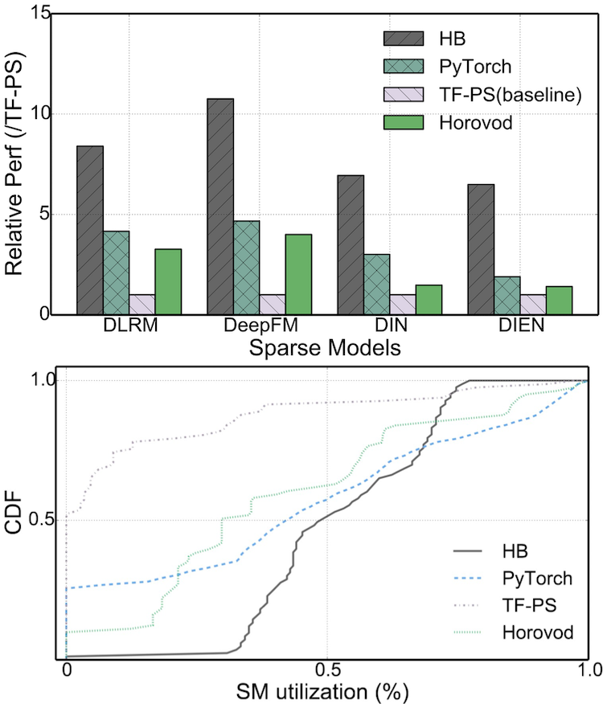

# Introduction

## Recommendation models

Model-based recommendation systems play key roles in internet industry, from
social network to e-commerce platform. Recommendation models are getting
deeper in recent years, which makes training on GPUs a good choice.

However, industrial-scale recommendation models are not only deeper, but also
much wider. Training wide-and-deep recommendation models on GPUs with real-world
datasets still suffers from low utilization and high cost.

## HybridBackend

HybridBackend is a high-performance framework for training wide-and-deep
recommendation model on heterogeneous cluster.

HybridBackend provides following features:

- Memory-efficient loading of categorical data

- GPU-efficient orchestration of embedding layers

- Communication-efficient training and evaluation at scale

- Easy to use with existing AI workflows

HybridBackend speeds up training of wide-and-deep recommendation models
dramatically:

